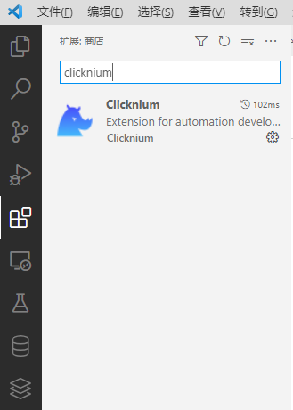
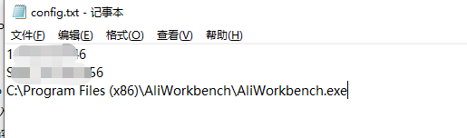
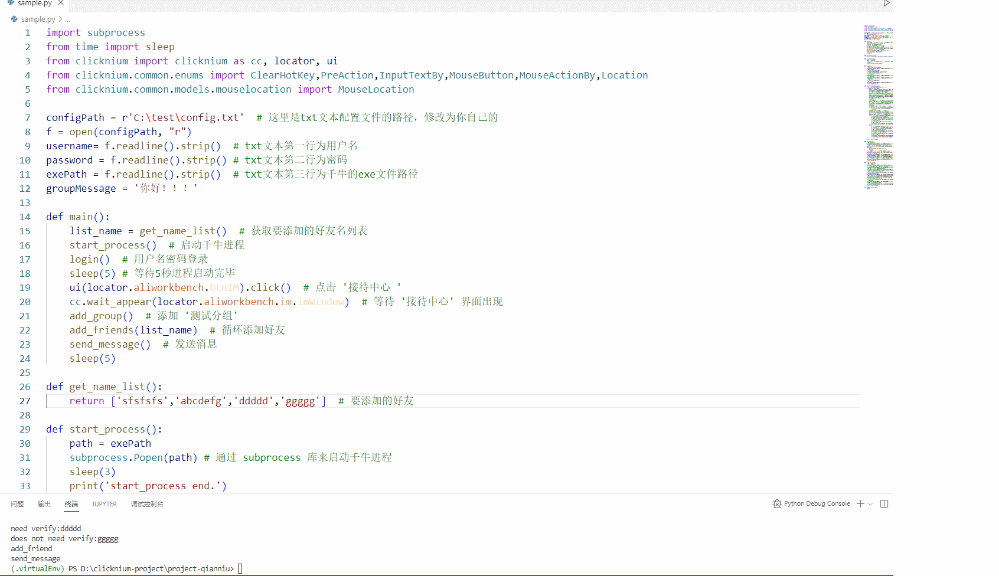

# python clicknium 库自动化千牛桌面端

**千牛**是阿里巴巴集团卖家工作台，商家经营的必备工具，今天我们使用python来自动化千牛桌面端。
**[clicknium](https://www.clicknium.com/)** 是基于 python 实现的一套 免费的UI 自动化的库，功能强大、简单易用，可以用来操作桌面、 web 、 java 、 sap 等应用。clicknium 相比于其他的自动化库，使用更简单，相比于大家熟知的 selenium，**[clicknium](https://www.clicknium.com/)** 上手更简单，页面元素的定位不需要人工再去写 xpath ，**内置的录制器录制一下页面元素控件就会自动生成选择器，同时 clicknium 还支持桌面应用**，在实现复杂混合web和桌面应用自动化场景中，可以无缝衔接；相比于 pywinauto  ，**[clicknium](https://www.clicknium.com/)**  内置的元素定位录制器，非常方便定位抓取控件元素，不需要像 pywinauto 还需要借助其他工具手动去筛选定位控件，使用 **[clicknium](https://www.clicknium.com/)**  录制器定位元素，效率将大大提升；**此外 [clicknium](https://www.clicknium.com/) 还支持图像识别来定位控件**，该功能有效的补充了基于元素控件特征定位的缺陷，在某些特殊的桌面软件中某些控件是没有控件树结构的，此时使用图像识别将发挥重要作用，官网也提供了详细的 **[文档](https://www.clicknium.com/documents)**，可以随时查阅。

下面我们使用 **[clicknium](https://www.clicknium.com/)**  来操作千牛桌面客户端。

##### 第一步：安装 clicknium vscode 扩展
    vscode 扩展页面搜索 **clicknium** , 安装即可（需要先安装vscode）


##### 第二步：安装 clicknium sdk（需要先安装python）

```
如果python版本<=3.8
pip install clicknium

python版本>=3.9
pip install --pre pythonnet
pip install clicknium
```
这里需要注意的是如果安装了多个版本的python，先选择vscode当前项目使用的python环境（ctrl+shift+p，然后输入 python:select interpreter，选择项目使用的python版本），然后在该python环境中安装clicknium package,这里可以先忽略，后面如果sample.py文件中无法识别clicknium，再来处理
##### 第三步：安装好后vscode左侧会多一个扩展（小犀牛头像）
点击小犀牛，然后点击sign in，会跳转官网需要注册登录下即可（支持github和google账号一键注册登录）
登录完成后跳转web页面点击Launch vscode，跳转回vscode,点击打开按钮

##### 第四步：创建Sample Project
* 在 vscode 中 Ctrl+shift+p, 
* 输入 clicknium 下拉列表中选择 Clicknium: Sample 
* 然后选择一个文件夹用来存放 sample 项目，等待创建示例完成

此时会看到文件夹中有一个sample.py文件和一个 .locator 文件夹；其中 sample.py 就是自动化的python业务代码，.locator 文件夹存放元素定位相关信息，它是自动管理的，可以不用管它

##### 第五步：先让生成的sample能够运行起来
生成的 sample 是对 web 页面的自动化操作，需要安装浏览器扩展，sample中使用的是edge浏览器，选择对应扩展安装即可（扩展安装在小犀牛页面）。然后直接就能运行 sample.py 文件了（按F5运行），流程会打开浏览器并且做一些自动化操作。

按照以上步骤环境就搭建完成，并且一个简单的web页面自动化就完成了。

接下来我们使用clicknium来自动化千牛桌面客户端。首先我们删除掉生成的main里面代码。

对千牛操作流程如下：（这里只是展示出clicknium的强大功能，流程本生的场景大家可以按照自己的需求具体来设计实现）
**注意：这里千牛第一次登录会有一个向导提示，需要用户登录过一次，并且将这些向导给点击过，在 接待中心 IM即时通讯页面也会有向导需要用户第一次登录后处理。**

下载安装[千牛windows客户端](https://work.taobao.com/), 具体步骤如下：
千牛版本【9.07.03N(02985)】

1. 启动千牛软件
2. 用户名、密码登录千牛
3. 打开"接待中心"
4. "我的好友"中添加一个新的组"测试分组"
5. 添加几个测试的好友，并且加入"测试分组"（好友需要验证的则跳过）
6. 向"测试分组"组员发送消息



以上功能基本能展现出clicknium的自动化能力，其中千牛客户端页面中还是有很多部分的控件是没有控件树结构的，所以需要借助图像识别来实现。

这里讲解下clicknium最核心结构，比如
```python
ui(locator.aliworkbench.login.btnLogin).click()
```
**ui 函数中传递的参数即为选择器，该选择器是通过录制器录制生成的，用来定位软件的控件位置，用户可以手动修改生成的选择器名称为更有意义的名字，该函数通过传入的选择器搜索定位到页面控件，然后返回 UiElement 对象，然后调用该对象的 click 方法，它就会点击该控件。**

下面为实现的python代码。

```python
import subprocess
from time import sleep
from clicknium import clicknium as cc, locator, ui
from clicknium.common.enums import ClearHotKey,PreAction,InputTextBy,MouseButton,MouseActionBy,Location
from clicknium.common.models.mouselocation import MouseLocation

configPath = r'C:\test\config.txt'  # 这里是txt文本配置文件的路径，修改为你自己的
f = open(configPath, "r")
username= f.readline().strip()  # txt文本第一行为用户名
password = f.readline().strip() # txt文本第二行为密码
exePath = f.readline().strip()  # txt文本第三行为千牛的exe文件路径
groupMessage = '你好！！！'

# 主方法
def main():
    list_name = get_name_list()  # 获取要添加的好友名列表
    start_process()  # 启动千牛进程
    login()  # 用户名密码登录
    sleep(5) # 等待5秒进程启动完毕
    ui(locator.aliworkbench.btnIM).click()  # 点击 '接待中心 '
    cc.wait_appear(locator.aliworkbench.im.imWindow)  # 等待 '接待中心' 界面出现
    add_group()  # 添加 '测试分组'
    add_friends(list_name)  # 循环添加好友
    send_message()  # 发送消息
    sleep(5)
    
def get_name_list():
    return ['sfsfsfs','abcdefg','ddddd','ggggg']  # 要添加的好友名称

# 启动进程
def start_process():
    path = exePath
    subprocess.Popen(path)  # 通过 subprocess 库来启动千牛进程
    sleep(3)
    print('start_process end.')

# 用户名密码登录
def login():
    # 首先清除掉已经有的账号
    ui(locator.aliworkbench.login.username).clear_text('send-hotkey',ClearHotKey.Home_ShiftEnd_Delete,PreAction.Click)
    # 填写用户名，这里无法使用UiElement对象的set_text 方法，它不是一个标准的edit输入框，我们可以使用全局的输入文本
    cc.send_text(username)
    # 发送enter快捷键，跳转到输入密码框
    cc.send_hotkey('{enter}')
    # 点击密码框
    ui(locator.aliworkbench.login.password).click()
    # 清空密码框
    ui(locator.aliworkbench.login.password).clear_text('send-hotkey',ClearHotKey.Home_ShiftEnd_Delete,PreAction.Click)
    # 输入密码
    cc.send_text(password)
    # 点击登录
    ui(locator.aliworkbench.login.btnLogin).click()
    print('login end.')

# 增加“测试分组”
def add_group():
    # 点击我的好友
    ui(locator.aliworkbench.im.btnMyFriend).click()
    # 判断测试分组是否已经存在，如果不存在则添加，存在则跳过
    exist = cc.is_existing(locator.aliworkbench.im.testGroup)
    if(exist):
        print('group already exist.')
        return
    # 在 我的好友 中第一个分组 右键弹出菜单
    ui(locator.aliworkbench.im.itemFriendGroup).click(MouseButton.Right)
    # 点击弹出菜单->添加组
    ui(locator.aliworkbench.im.menuAddGroup).click()
    # 输入测试分组，参数我们选择SendKeyAfterClick，意思是先点击输入框获取焦点，然后输入'测试分组'文本
    ui(locator.aliworkbench.im.txtNewGroupName).set_text('测试分组',InputTextBy.SendKeyAfterClick)
    # 通过再次点击'我的好友' 使得当前输入框丢失焦点，创建'测试分组'生效
    ui(locator.aliworkbench.im.btnMyFriend).click()
    print('add_group end.')

# 循环添加几个好友
def add_friends(list_name):
    for name in list_name:
        # 点击'搜索框'，并且清空文本，通过Home ShiftEnd Delete 组合快捷键来删除已有文本
        ui(locator.aliworkbench.im.txtSearch).clear_text('send-hotkey',ClearHotKey.Home_ShiftEnd_Delete,PreAction.Click)
        # '搜索框' 输入要添加的好友名称
        ui(locator.aliworkbench.im.txtSearch).set_text(name,InputTextBy.SendKeyAfterClick)
        # 点击'在网络中查找',这里该控件是没有控件树结构的，所以只能通过图像识别先识别位置，然后来点击它，
        # 由于各个电脑大小分辨率等不同，
        # 如果这个地方没有识别通过,你可以在你的电脑上重新使用录制器图像识别的方式抓取下该控件
        ui(locator.aliworkbench.im.btnSearchOnNetwork).click()
        # 睡眠1s,等待搜索结果出现
        sleep(1)
        # 这里需要点击第一条搜索结果，然后在聊天界面中点击添加好友按钮
        # 这里同样搜索结果是没有控件树结构的，并且每次内容都是不同的（也就不能使用图像识别方式来点击）
        # 所以我们通过定位'搜索框'+向下偏移40px坐标的方式 来点击第一条搜索结果
        ui(locator.aliworkbench.im.txtSearch).click(mouse_location=MouseLocation(Location.Center,yoffset=40))
        sleep(1)
        # 判断聊天界面中间顶部是否有'加为我的好友'按钮（如果没有，说明已经是好友则跳过）
        if not (cc.is_existing(locator.aliworkbench.im.btnAdd)):
            print(f'already a friend:{name}')
            continue
        # 还不是好友，则点击'加为我的好友'
        ui(locator.aliworkbench.im.btnAdd).click()
        # 添加好友有几种结果，一种是需要对方验证的，另一种是不需要验证，直接就能添加成功的
        # 判断是否弹出了添加好友验证的提示框
        if(cc.wait_appear(locator.aliworkbench.im.addWindow,wait_timeout=5)):
            print(f'need verify:{name}')
            # 需要验证信息，点击输入框，这里同样是通过图像识别方式
            ui(locator.aliworkbench.im.inputVerifyInfo).click()
            # 填写验证信息
            cc.send_text('你好，我是小千牛。')
            # 点击'确定'按钮
            ui(locator.aliworkbench.im.btnSendVerify).click()
        else:
            # 另一种不需要验证信息，直接添加好友成功，我们这里将添加的好友加入到我们创建的'测试分组'中。
            # 这里等待'添加好友成功'页面'完成'按钮出现
            cc.wait_appear(locator.aliworkbench.im.btnComplete)
            # 点击选择组，弹出下拉框
            ui(locator.aliworkbench.im.selectGroup).click()
            # 点击下拉框中的'测试分组'
            ui(locator.aliworkbench.im.friendGroup).click(MouseButton.Left,by=MouseActionBy.MouseEmulation)
            # 点击'完成'按钮
            ui(locator.aliworkbench.im.btnComplete).click()
            print(f'does not need verify:{name}')
    print('add_friend end.')

# 给‘’测试分组‘’用户发送消息
def send_message():
    # 点击'我的好友'
    ui(locator.aliworkbench.im.btnMyFriend).click()
    # 图像识别到定位到'测试分组'，右键点击它,弹出菜单
    ui(locator.aliworkbench.im.testGroup).click(MouseButton.Right)
    # 点击弹出菜单-> 向组员群发消息
    ui(locator.aliworkbench.im.menuSendGroupMessage).click()
    # 等待'群发即时消息'窗口出现
    cc.wait_appear(locator.aliworkbench.im.sendGroupMsgWindow)
    # 输入待发送消息内容
    ui(locator.aliworkbench.im.inputGroupMessage).set_text(groupMessage,InputTextBy.SendKeyAfterClick)
    # 点击'发送'按钮，没有控件树结构，只能图像识别
    ui(locator.aliworkbench.im.btnSendGroupMsg).click()
    # 等待消息发送完成弹窗出现
    cc.wait_appear(locator.aliworkbench.im.sendSuccessWindow)
    # 关闭弹窗
    ui(locator.aliworkbench.im.btnSendOK).click()
    # 关闭 '群发即时消息'窗口
    ui(locator.aliworkbench.im.closeSendGroupMsgWindow).click()
    print('send_message end.')
```
流程编写完成后F5运行即可



##### 最后总结下
如果你想使用 python 来自动化，那么无论是 web 还是桌面端应用， **[clicknium](https://www.clicknium.com/)** 都将是一个非常好的选择，使用简单，能够应对很多场景。
我们总结下流程中使用了哪些自动化技术：
 * 发送快捷键
 * 清空文本
 * 输入文本
 * 全局输入文本
 * 点击
 * 相对定位+偏移量点击
 * 图像点击
 * 等待元素出现
 * 判断元素是否存在

当然还有很多方便的自动化api,我们还没有使用上，后续遇到需求可以去参考官方文档。
其实千牛这款桌面端软件，对于自动化的支持不是特别友好的，在开发自动化过程中，我们使用了一些技巧以及对于录制的选择器做了修改，因为每次千牛重新启动他的控件树种的定位特征元素值都是改变的，所以我们去掉了一些自动生成的属性，比如AutomationId，
如果是对于notepad、一些常见的ERP系统等他们录制的元素都是很稳定的，不需要人工干预修改。
至于选择器更详细的使用和技巧，大家可以参照 **[官方文档](https://www.clicknium.com/documents/automation/)** ，但是整体思路就是录制定位元素，获取到选择器，验证能够通过，但是在千牛软件重启后再次到对应页面验证不通过，那么此时可能就需要手动微调下选择器，但是大部分场景自动录制的选择器都是可以稳定运行的。

开发自动化的过程思路总结：
    就类似与开发一款软件，我们先要整理清楚需求，然后将需求细分，然后对人工操作的步骤一步步拆解成一个个子函数或者子模块，最终构建成完整的流程，最后在适当地方加入异常处理和重试机制，构建健壮的能稳定运行的自动化流程。